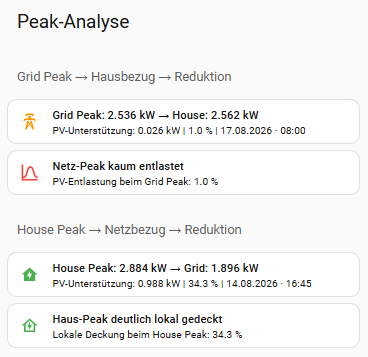

# Peak Analysis

> **Purpose of the view:** The two relevant power peaks – **Grid Peak** and **House Peak** – are evaluated separately and supplemented with the corresponding local reduction.

---

## Overview



The view answers two different questions:

| Section | Meaning |
|---|---|
| **Grid Peak → House Consumption → Reduction** | How strongly was the highest grid import reduced by local generation? |
| **House Peak → Grid Import → Reduction** | How much of the highest house load was covered locally and how much power had to be imported from the grid? |

> The peak sensors used are based on **15-minute power values**. This means the view does not show short-term instantaneous peaks, but the 15-minute values relevant for peak analysis.

---

## Grid Peak

### Sensors Used

| Sensor | Usage |
|---|---|
| `sensor.total_grid_power_peak_month` | Highest grid import of the current month in kW |
| `sensor.total_house_power_at_grid_peak` | House power at the time of the Grid Peak |
| `sensor.total_grid_reduction_at_grid_peak` | Local support at the Grid Peak in kW |
| `sensor.total_grid_reduction_at_grid_peak_percent` | Percentage reduction of grid import at the Grid Peak |

The `peak_time` attribute of `sensor.total_grid_power_peak_month` provides the date and time of the Grid Peak.

### Meaning of the Display

This section shows how strongly the **highest grid import** was reduced by local generation.

In the displayed example:

| Metric | Value |
|---|---:|
| Grid Peak | **2.536 kW** |
| House at Grid Peak | **2.562 kW** |
| PV support | **0.026 kW** |
| Reduction | **1.0%** |

**Interpretation:** The highest grid import was only reduced to a very small extent by local generation.

### Status Evaluation

| Local reduction | Display |
|---:|---|
| `< 10%` | **Grid peak barely reduced** |
| `10–< 30%` | **Grid peak partially reduced** |
| `≥ 30%` | **Grid peak significantly reduced** |

---

## House Peak

### Sensors Used

| Sensor | Usage |
|---|---|
| `sensor.total_house_power_peak_month` | Highest house power of the current month in kW |
| `sensor.total_grid_power_at_house_peak` | Grid import at the time of the House Peak |
| `sensor.total_grid_reduction_at_house_peak` | Locally covered share at the House Peak in kW |
| `sensor.total_grid_reduction_at_house_peak_percent` | Local coverage of the House Peak in percent |

The `peak_time` attribute of `sensor.total_house_power_peak_month` provides the date and time of the House Peak.

### Meaning of the Display

This section shows how much of the **highest house load** was covered locally and what share had to be imported from the grid at that time.

In the displayed example:

| Metric | Value |
|---|---:|
| House Peak | **2.884 kW** |
| Grid at House Peak | **1.896 kW** |
| PV support | **0.988 kW** |
| Local coverage | **34.3%** |

**Interpretation:** At the highest house load, a significant share of the demand was covered locally. As a result, grid import remained clearly below the actual house load.

### Status Evaluation

| Local coverage | Display |
|---:|---|
| `< 10%` | **House peak almost entirely supplied by the grid** |
| `10–< 30%` | **House peak partially covered locally** |
| `≥ 30%` | **House peak significantly covered locally** |

---

## Short Interpretation

- **Grid Peak** evaluates the reduction of the maximum grid load.
- **House Peak** evaluates the local coverage of the maximum house load.
- The two views complement each other: a high House Peak does not necessarily result in an equally high Grid Peak.
- The percentage values show directly how strongly local generation influences each peak.

---

## YAML Configuration

```yaml
type: grid
column_span: 1
cards:
  - type: custom:mushroom-title-card
    title: Peak-Analyse
  - type: custom:mushroom-title-card
    subtitle: Grid Peak → Hausbezug → Reduktion
  - type: custom:mushroom-template-card
    primary: >
      Grid Peak: {{ states('sensor.total_grid_power_peak_month') }} kW → House:
      {{ states('sensor.total_house_power_at_grid_peak') }} kW
    secondary: >
       PV-Unterstützung: {{
      states('sensor.total_grid_reduction_at_grid_peak') }} kW | {{
      states('sensor.total_grid_reduction_at_grid_peak_percent') }} %  | {{ as_timestamp(peak_time) | timestamp_custom('%d.%m.%Y ·
      %H:%M', true) }} 
    icon: mdi:transmission-tower
    icon_color: orange
    multiline_secondary: false
    grid_options:
      columns: 12
      rows: 1
  - type: custom:mushroom-template-card
    primary: >
       
        Netz-Peak kaum entlastet
      
        Netz-Peak teilweise entlastet
      
        Netz-Peak deutlich entlastet
      
    secondary: >
      PV-Entlastung beim Grid Peak: {{
      states('sensor.total_grid_reduction_at_grid_peak_percent') }} %
    icon: mdi:chart-bell-curve
    icon_color: >
        red  orange  green
      
    grid_options:
      columns: full
  - type: custom:mushroom-title-card
    subtitle: House Peak → Netzbezug → Reduktion
  - type: custom:mushroom-template-card
    primary: >
      House Peak: {{ states('sensor.total_house_power_peak_month') }} kW → Grid:
      {{ states('sensor.total_grid_power_at_house_peak') }} kW
    secondary: >
       PV-Unterstützung: {{
      states('sensor.total_grid_reduction_at_house_peak') }} kW | {{
      states('sensor.total_grid_reduction_at_house_peak_percent') }} %  | {{ as_timestamp(peak_time) | timestamp_custom('%d.%m.%Y ·
      %H:%M', true) }} 
    icon: mdi:home-lightning-bolt
    icon_color: green
    multiline_secondary: false
    grid_options:
      columns: 12
      rows: 1
  - type: custom:mushroom-template-card
    primary: >
       
        Haus-Peak fast vollständig aus dem Netz
      
        Haus-Peak teilweise lokal gedeckt
      
        Haus-Peak deutlich lokal gedeckt
      
    secondary: >
      Lokale Deckung beim House Peak: {{
      states('sensor.total_grid_reduction_at_house_peak_percent') }} %
    icon: mdi:home-lightning-bolt-outline
    icon_color: >
        red  orange  green
      
    grid_options:
      columns: full

```
